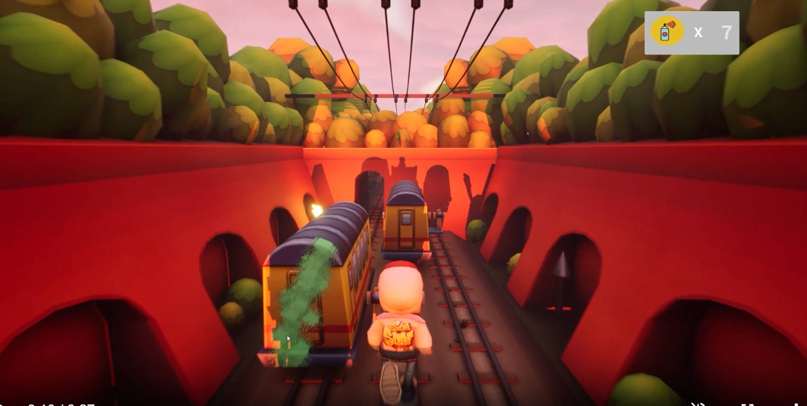
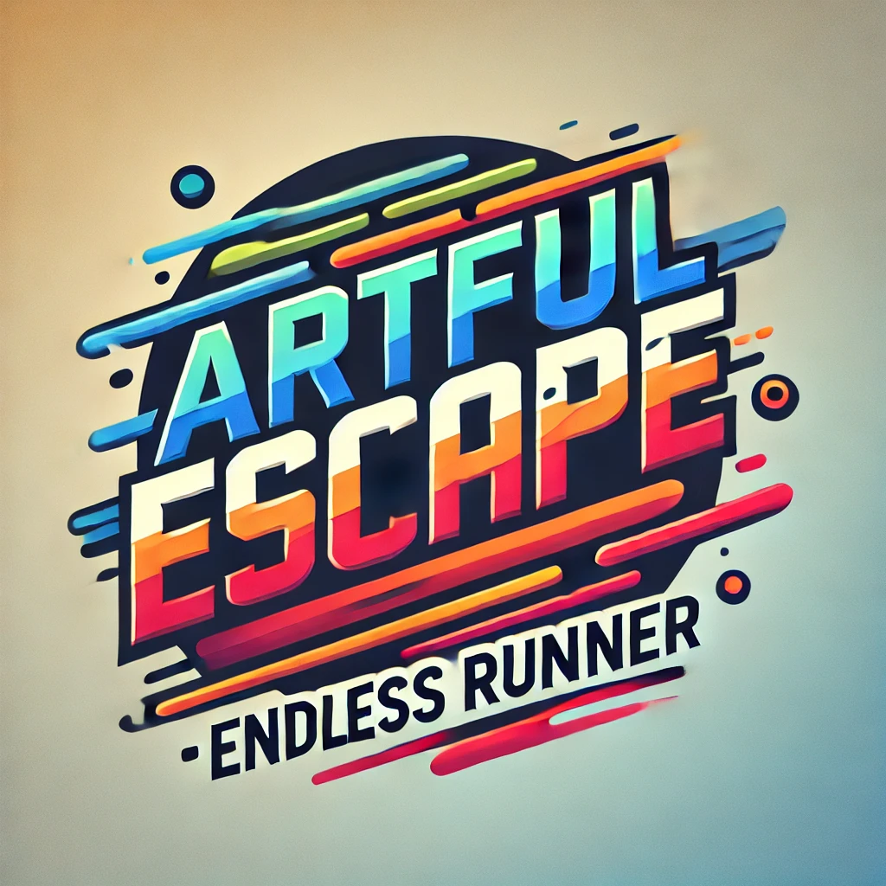

# ArtfulEscapeEndlessEvasion
 
 

https://github.com/user-attachments/assets/1259027c-5dd3-44ab-b6e7-42df59eec064

## Description
**Artful Escape Endless Evasion** is an exciting endless runner game where players dodge obstacles, speed up as they progress, and perform daring jumps and crouches to stay alive. But it’s more than just evading! In our game, players can spray graffiti on objects in their path, using it not only as an art form but as a tool to solve puzzles, destroy obstacles, and even pick up weapons.

Collect "Graffiti Power" to unlock your spray can, which is key to navigating the trickiest challenges and unleashing your creativity as you escape. Will you run fast enough to keep up? Will your spray be powerful enough to clear the path? Dive in and find out!

## Key Features
- **Endless Running**: A thrilling, high-speed escape that intensifies the longer you survive.
- **Dynamic Obstacles**: Jump, crouch, and dodge various obstacles on your way to freedom.
- **Graffiti Mechanics**: Spray graffiti to solve puzzles, break down obstacles, and unlock weapons.
- **Collectible Graffiti Power**: Gather power-ups to activate your spray abilities.

